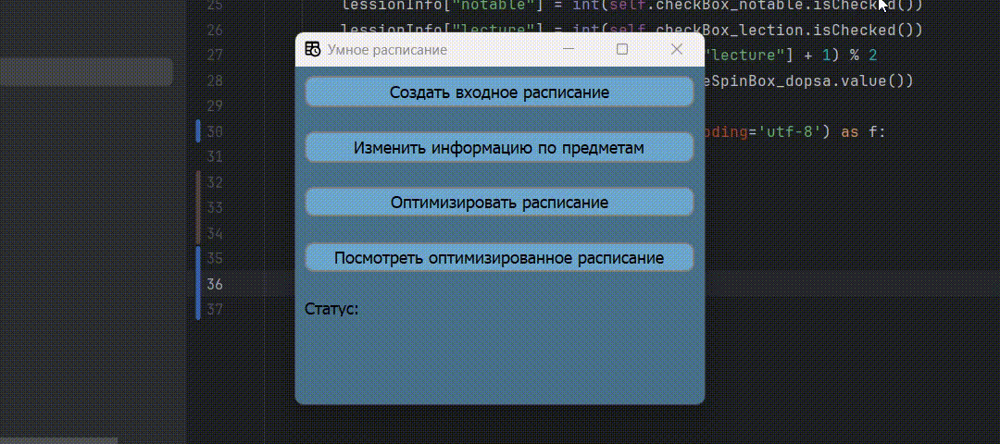

# schedule_optimizer

## Обзор

Этот проект реализует приложение, позволяющее на основе расписания и некоторой информации о предметах вывести наиболее удобную формулу посещения занятий.

## Пример использования

## Структура проекта на GitHub

1. `app`
   - Файлы реализующие логику поведения приложения
2. `templates`
   - ui файлы для реализации графического интерфейса
3. `data`
   - Файлы из которых данные загружаются в приложение
4. `img`
   - Все файлы изображений.

## Стек

Python, PyQt5, numpy, scikit-learn
